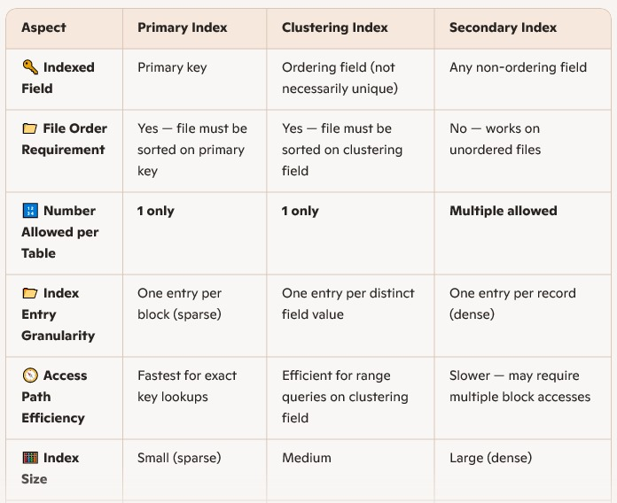
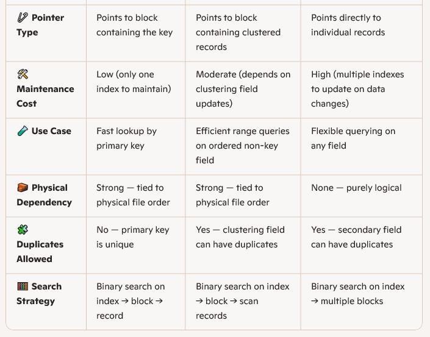

- The smallest unit of data transfer is a block/page, which contains a multiple records
- When inserting, deleting, updating:
    - Look up block
    - Load it into memory
    - Do the operation
    - Save it to disk
- So we always deal with blocks in memory (RAM) never on the disk
- Blocking Factor (bfr): Block Size / Record Size
- 2 Basic file organizations:
     - Heap Files (unordered files):
         -  Records are stored **in no particular order**.
         - New records are simply **inserted at the end** of the file or in any available space.
         - Think of it like a _pile of papers thrown together_ → no sorting, no ordering.
         -  **When is Heap used?**
            - When you often insert new records
            - When you usually retrieve **all records**
            - When you don’t search by a particular key frequently.
        - Cost is Searching is **slow** because you must scan the whole file (linear search).
    - Sequential Files (ordered files):
         - Records are stored **sorted by some key** (e.g., ID).
         - Think of them like color-labeled folders arranged alphabetically.
         - **When is Sequential used?**
             - When you often search by the sorting key.
             - When you need range queries, like: Find students with ID between 1000 and 2000
        - Cost is Searching is **fast** using binary search. But inserting new records is **expensive** because the order must be maintained.

# Indexing

- Indexing is the principal technique used to efficiently answering a given query.
- An Index for a DB is like an Index in a book:
    1. It is smaller than the book
    2. The words are in sorted order
    3. If we are looking for a particular topic we first search on the index, find the pages where it is discussed, go to the actual pages in the book.

## Understanding Indexing

- An **index** is an _auxiliary file_ → it supports the main data but does not store the actual records.
- Indexes are created on one or more columns in a table
- An index is created for specific field(s), Usually for field(s) that appear in WHERE
- Indexes speeds up search but slows down insert, delete and update.
- Changes in the data ➔ changes in the index
## Indexes as Access Paths

- The index file usually occupies considerably less disk blocks than the data file because its entries are much smaller
- Index is always sorted on index fields
- A binary search on the index yields a pointer to the file record
- Indexes have 2 Characteristics:
     1. Dense Index: has an index entry for every search key in the data file.
     2. Sparse (or non- dense) index: has index entries for only some of the search values. Or One entry in the index file for each block of the data file.

## Sparse Indices

- Some keys in the data file will not have an entry in the index file
- Applicable when records are sequentially ordered on search-key (Ordered files)
- Normally keeps only one key per data block
- Less Space (Can Keep more of index in memory)
- Less Maintenance overhead for insertions and deletions

## Types of Indexes

### Single Level Indexes

#### Primary Index

- Index on sequential file (ordered file)
-  Usually used when the search key is also the primary key of the relation.
- Usually, these indexes fit in main memory.
- We can only build one primary index for a data file because we always have on primary key.
- An index file record contains the field value (primary key value) and block pointer
- A primary index is usually Sparse

#### Clustering Index

- For sequential data files, Based on the ordering field.
- Not necessarily unique, but must be not null
- For every distinct ordering field value ➔ index record
- When it goes to a block that has the value we are looking for and the block ends with the value still existing it then get the next block to continue retrieving as there is a possibility this value continues in the next block.
- A clustering index is usually Sparse

#### Secondary Index

- For any data file type
- **A secondary index = an extra index**
    - Not built on the primary key
    - Not built on the attribute used to order the file
    - It’s an **additional** index that helps searching by other attributes
- Example:  
     A file is sorted by **StudentID** → this is the primary access path.  
     If you also want to quickly search by **StudentName**, you build a **secondary index**.
 - Secondary Indexes facilitate query-answering -> Make searching faster
 - A file can have several secondary indexes.
 - Indexing field is not necessarily the ordering field
 - More than one data block may be needed for a given search key in general more disk I/O to answer queries: Secondary Indexes are less efficient than Primary Indexes
 - Secondary index on a non-key must be dense, Secondary index on a key can be sparse




### Multi Level Indexes

- Used when the index file is too large to fit in memory
- Because a single-level index is an ordered file, we can create a primary index to the index itself. (Index on the Index):
     - In this case, the original index file is called the first-level index and the index to the index is called the second-level index.
     - We can repeat the process, creating a third, fourth, ..., top level until all entries of the top level fit in one disk block
- This provides faster search but slower updates
- A multi-level index is a form of search tree, However, insertion and deletion of new index entries is a problem because every level of the index is an ordered file.

### B-Tree

- A B-Tree is a multilevel index with a Tree structure, used to index very-large relations when single-level indexes don’t fit in main memory
- The B stands for Balanced Tree.
- B-tree is usually a 3 levels tree: the root, an intermediate level, the leaves.
- All the leaves are at the same level as it is a balanced tree
- The size of each node of the B-tree is equal to a disk block.
- All nodes have the same format: n keys and n+1 pointers → n key-pointer pairs plus 1 extra pointer, ex: 3 keys and 4 pointers

## Index Syntax in SQL Server

- To Create Index:

```sql
CREATE INDEX index_name ON table_name (attribute_list);
```

- To Drop Index:

```sql
DROP INDEX index_name;
```